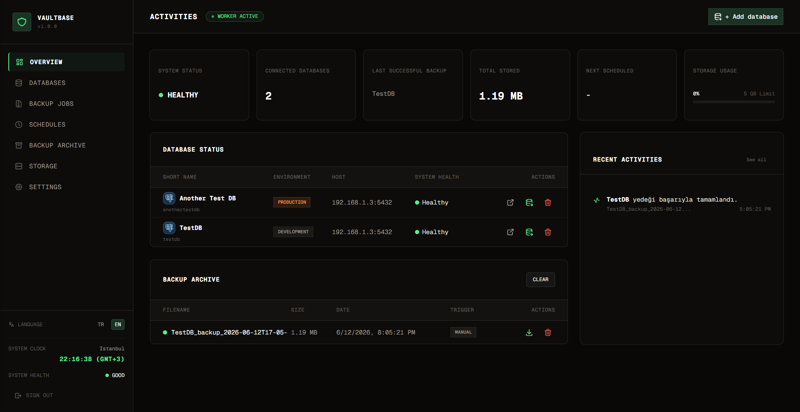
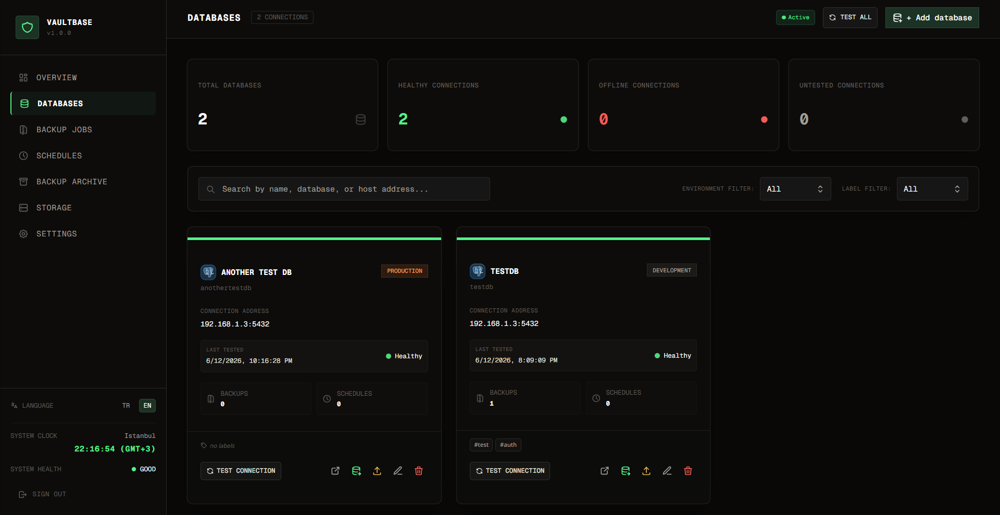
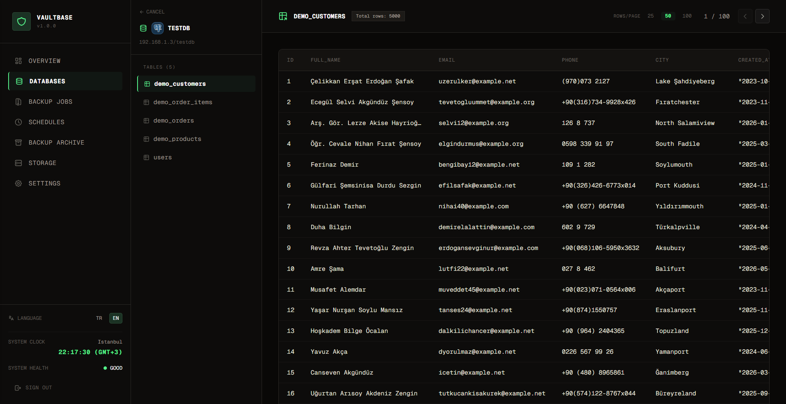
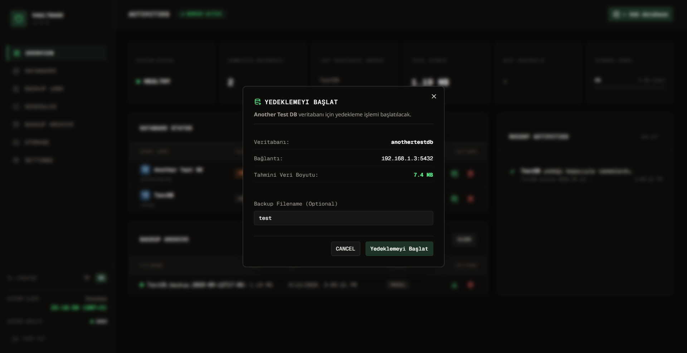

<div align="center">

# 🗄️ VaultBase

**Şık, self-hosted PostgreSQL ve MongoDB yedekleme yöneticisi ve salt okunur veritabanı gezgini.**

[](README.md)
[](https://nextjs.org/)
[](https://tailwindcss.com/)
[](https://www.prisma.io/)
[](https://www.docker.com/)
[](LICENSE)

[Özellikler](#-öne-çıkan-özellikler) · [Hızlı Başlangıç](#-hızlı-başlangıç) · [Docker Kurulumu](#-docker-ile-çalıştırma) · [Yapılandırma](#-yapılandırma) · [Ekran Görüntüleri](#-görsel-tur)

</div>

---

## 🔍 Genel Bakış

VaultBase; yedeklerinizi yönetmenizi, geri yükleme işlemlerini gerçekleştirmenizi ve birden fazla PostgreSQL ve MongoDB veritabanını tek bir modern panelden güvenle incelemenizi sağlayan, hafif ve **tamamen self-hosted** bir web uygulamasıdır. Arka planda zamanlanmış yedekleri çalıştırır, gerçek zamanlı bağlantı durumlarını izler ve veritabanı erişim şifrelerinizi güvenli bir şekilde şifreler.

---

## ✨ Öne Çıkan Özellikler

### 🔑 Önce Güvenlik
* **AES-256-CBC Şifreleme**: Tüm hedef veritabanı bağlantı dizesi ve şifreleri, size özel belirlediğiniz `APP_SECRET` anahtarı ile diskte şifreli olarak saklanır.
* **Rota Koruması**: HMAC-SHA256 imzalı oturum çerezleri ile yetkisiz erişimlerin önüne geçilir.
* **Güvenli SQL Sorguları**: Veritabanı gezgini salt okunur modda çalışır ve SQL injection korumasına sahiptir.

### 📦 Yedekleme & Geri Yükleme
* **Manuel Yedekleme**: Tek tıkla yedek oluşturun, işlem öncesinde tahmini yedek dosya boyutunu görün.
* **Zamanlanmış Görevler**: Her veritabanı için panel üzerinden özel `node-cron` zamanlaması atayın.
* **Gzip Sıkıştırma**: Tüm yedekler diskte yer kaplamaması için `.sql.gz` formatında sıkıştırılarak saklanır.
* **Geri Yükleme Akışı**: Hedef şemayı otomatik sıfırlayarak `.sql.gz` yedeğini psql üzerinden geri yükler ve işlem günlüklerini gerçek zamanlı ekrana yansıtır.
* **PostgreSQL**: `pg_dump` ile `--clean --if-exists` bayraklarıyla temiz yedekleme ve geri yükleme.
* **MongoDB**: `mongodump` / `mongorestore` ile `--gzip --archive --drop` bayraklarıyla tutarlı anlık görüntüler.
* **Tür Yönlendirmesi**: Bağlantı URL'sinden otomatik veritabanı türü algılama (`postgresql://` vs `mongodb://`).

### 🔍 Salt Okunur Gezgin
* **Tablo/Collection Tarayıcı**: Tabloları/collection'ları listeleyin, şemaları/dökümanları inceleyin ve sayfalanmış veriyi temiz, modern bir arayüzde gezinin.
* **PostgreSQL Gezgini**: Tablolara göz atın, satırlar arasında sayfalama yapın, SQL injection korumalı salt okunur sorgular.
* **MongoDB Gezgini**: Instance üzerindeki tüm veritabanlarındaki collection'lara göz atın, dinamik kolon düzleştirme ile dökümanları görüntüleyin, sayfalama yapın.
* **Veritabanı Türü Rozetleri**: PostgreSQL mavi / MongoDB yeşil logo ile anında görsel tanıma.

### ⚙️ Ayarlar & Taşınabilirlik
* **Yapılandırma Senkronizasyonu**: Ayarları JSON dosyası olarak dışa aktarın veya içe aktarın. İsteğe bağlı olarak yapılandırma dosyalarınızı şifreyle koruyabilirsiniz.
* **Durum Kontrol Polling**: Sayfa açıkken otomatik ve periyodik veritabanı durum kontrolleri (15sn / 30sn / 1dk).

---

## 📸 Görsel Tur

### 1. Genel Bakış Paneli
Genel istatistikleri, aktif veritabanlarının durumlarını, depolama sınırlarınızı ve son aktiviteleri izleyin.


### 2. Bağlantı Yöneticisi
Geliştirme, Staging ve Production ortamlarındaki veritabanlarını ekleyin, düzenleyin ve durumlarını gerçek zamanlı test edin.


### 3. Salt Okunur Veritabanı Gezgini
Yanlışlıkla veri değiştirme endişesi olmadan tablolarınızı listeleyin, sayfalar arasında gezinin.


### 4. Yedekleme & Geri Yükleme Ekranları
Yedekleme başlatmadan önce tahmini boyutu görün, geçmiş yedeklerinizi yönetin ve tek tıkla geri yüklemeleri başlatın.


---

## 🚀 Hızlı Başlangıç

### Gereksinimler

| Araç | Minimum Sürüm |
|---|---|---|
| Node.js | v20+ |
| pnpm | v8+ |
| PostgreSQL İstemcisi (`pg_dump`) | v14+ |
| MongoDB Araçları (`mongodump`, `mongorestore`) | v7.0+ |

> [!NOTE]
> VaultBase uygulamasını Docker ile çalıştırıyorsanız, `pg_dump` (postgresql-client-18) ve `mongodump`/`mongorestore` (MongoDB Database Tools 8.0) container içinde hazır gelmektedir.

### Yerel Kurulum

```bash
# 1. Repoyu klonlayın
git clone https://github.com/kullanici/vaultbase.git
cd vaultbase

# 2. Bağımlılıkları yükleyin
pnpm install

# 3. Ortam değişkenlerini oluşturun
cp .env.example .env
# .env dosyasını düzenleyerek en az 32 karakterli güvenli bir APP_SECRET girin

# 4. SQLite ayar veritabanını hazırlayın
pnpm prisma db push

# 5. Geliştirme sunucusunu başlatın
pnpm dev
```

Uygulamayı tarayıcınızda açın: **http://localhost:3000**

---

## 🐳 Docker ile Çalıştırma

VaultBase'i çalıştırmanın en kolay yolu Docker Compose kullanmaktır:

```bash
# .env dosyasını kopyalayın ve yapılandırın
cp .env.example .env

# Container'ları arka planda başlatın
docker compose up -d

# Container günlüklerini (logs) takip edin
docker compose logs -f app

# Uygulamayı durdurun
docker compose down
```

SQLite ayar veritabanı ve yedek dosyalarınız sırasıyla container içindeki `/app/data` ve `/app/backups` kalıcı disk alanlarına (volume) kaydedilir.

---

## ⚙️ Yapılandırma

`.env` dosyanızda aşağıdaki değişkenleri tanımlayabilirsiniz:

| Ortam Değişkeni | Açıklama | Zorunlu | Varsayılan / Örnek |
|---|---|---|---|
| `DATABASE_URL` | SQLite ayar veritabanının dosya yolu | Evet | `file:./vaultbase.db` |
| `APP_SECRET` | AES şifreleme için en az 32 karakterlik anahtar | Evet | *Size özel güvenli rastgele dize* |
| `ADMIN_USERNAME`| Web Paneli Yönetici Kullanıcı Adı | Evet | `admin` |
| `ADMIN_PASSWORD`| Web Paneli Yönetici Şifresi | Evet | *Size özel güçlü bir şifre* |
| `BACKUP_DIR` | Yedek dosyalarının yazılacağı dizin | Hayır | `./backups` |
| `STORAGE_LIMIT_MB`| Maksimum yerel depolama sınırı (Megabayt cinsinden) | Hayır | `5120` (5 GB) |

> [!WARNING]
> `APP_SECRET` anahtarını güvenli bir yerde saklayın. Bu anahtar değiştirilir veya kaybolursa, şifreli veritabanı şifreleri çözülemez hale gelir.

---

## 📁 Proje Yapısı

```
.
├── proxy.ts                        # Rota koruma middleware'i
├── instrumentation.ts              # Next.js instrumentation (zamanlanmış yedekleri tetikler)
├── app/
│   ├── actions.ts                  # Backend Server Action'ları
│   ├── page.tsx                    # Dashboard (Genel Bakış)
│   ├── login/                      # Giriş sayfası formu
│   ├── archive/                    # Yedek arşivi tablosu
│   ├── databases/                  # Veritabanı bağlantı yönetimi & çoklu-DB Explorer
│   ├── jobs/                       # İşlem logları & geçmişi
│   ├── schedules/                  # Otomatik yedekleme cron yöneticisi
│   ├── settings/                   # Yapılandırma içe/dışa aktarım sayfası
│   ├── storage/                    # Disk alanı analiz sayfası
│   └── api/                        # Yedek indirme ve geri yükleme rotaları
├── components/
│   ├── ui/                         # Shadcn UI ortak bileşenleri
│   ├── archive-page-client.tsx     # Arşiv arayüzü
│   ├── dashboard-tables.tsx        # Dashboard veritabanı ve yedek listesi
│   ├── database-modal.tsx          # Bağlantı ekleme & düzenleme modalı
│   ├── database-type-mark.tsx      # PostgreSQL/MongoDB tür rozeti
│   ├── databases-page-client.tsx   # Bağlantı listeleme (test/backup/restore)
│   ├── i18n-provider.tsx           # İstemci tarafı dil contexti
│   ├── jobs-page-client.tsx        # İşlem geçmişi arayüzü
│   ├── schedules-page-client.tsx   # Zamanlama arayüzü
│   ├── sidebar.tsx                 # Yan navigasyon
│   ├── storage-page-client.tsx     # Depolama analiz arayüzü
│   └── theme-provider.tsx          # Tema sağlayıcı
├── lib/
│   ├── auth.ts                     # Session oturum yönetimi (HMAC-SHA256)
│   ├── backup-mongo-service.ts     # mongodump spawn executor (MongoDB)
│   ├── backup-service.ts           # pg_dump spawn executor + tür yönlendirmesi
│   ├── cron-service.ts             # node-cron zamanlayıcılarını yönetir
│   ├── db-mongo-client.ts          # MongoDB dinamik bağlantı & sorgular
│   ├── db.ts                       # SQLite Prisma bağlantı istemcisi
│   ├── db-client.ts                # PostgreSQL dinamik bağlantı havuzu
│   ├── encryption.ts               # AES-256-CBC şifreleme yardımcısı
│   ├── i18n.ts                     # Dil çeviri yardımcıları
│   ├── restore-mongo-service.ts    # gunzip → mongorestore geri yükleme
│   ├── restore-service.ts          # gunzip → psql geri yükleme
│   ├── utils.ts                    # cn() tailwind-merge yardımcısı
│   └── locales/                    # İngilizce (en) ve Türkçe (tr) dil paketleri
├── prisma/                         # Veritabanı şeması ve migrasyon tanımları
├── prisma.config.ts                # Prisma 7 konfigürasyonu
├── scripts/                        # Geliştirici test betikleri
└── Dockerfile                      # Next.js + postgresql-client-18 + mongodb-database-tools paketlerini barındırır
```

---

## 🤝 Katkıda Bulunma

Projeye katkı sağlamak isterseniz aşağıdaki adımları izleyebilirsiniz:

1. Projeyi fork edin.
2. Yeni bir özellik dalı açın: `git checkout -b feature/yeni-ozellik`
3. Değişikliklerinizi kaydedin: `git commit -m 'feat: S3 desteği eklendi'`
4. Dalı push edin: `git push origin feature/yeni-ozellik`
5. Pull Request açın.

---

## 📄 Lisans

Bu proje MIT Lisansı altında lisanslanmıştır. Daha fazla bilgi için `LICENSE` dosyasına göz atabilirsiniz.

---

<div align="center">

**VaultBase** — Verileriniz her zaman güvende 🔐

</div>
